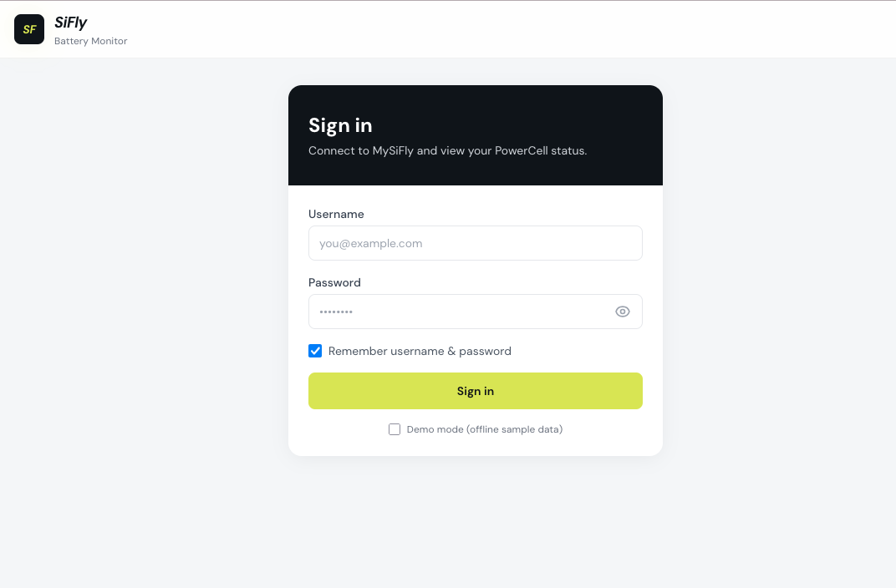
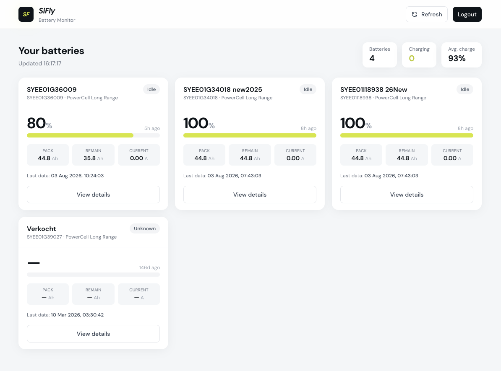

# SiFly Battery Monitor

Een klein, praktisch portaal om snel de status van je SiFly PowerCells te zien — zonder eerst de app te openen.

## Waarom dit bestaat

Wie met meerdere PowerCells werkt, wil vooral één ding weten: **hoe vol zitten ze?** Niet omdat je ze altijd tot 100% moet laden — juist niet — maar omdat je in één oogopslag wilt zien welke batterijen klaar zijn voor de volgende rit, en welke nog even mogen wachten.

De officiële MySiFly-app kan dat natuurlijk ook. Maar soms is sneller beter: even de status checken vanaf je telefoon, via een bladwijzer of snelkoppeling op je homescreen. Geen app starten, geen zoeken. Gewoon openen, kijken, klaar.

Dat is precies wat dit portaal doet.

## Inloggen

Log in met je bestaande MySiFly-account. Daarna zie je meteen je batterijen — live, via dezelfde bron als de officiële omgeving.

## Overzicht in één oogopslag

Na het inloggen krijg je een overzicht van al je batterijen: laadniveau, status (laden, ontladen of idle), capaciteit en wanneer de laatste meting binnenkwam. Zo zie je in seconden of een pack op 80% staat — vaak precies waar je hem wilt hebben — of toch even bijgeladen moet worden.

Per batterij kun je details openen: actuele telemetry, BMS-status en de laatste metingen. Handig als je even dieper wilt kijken, zonder de rest van je workflow te verstoren.

## Wat het wél is (en wat niet)

- **Wel:** een lichtgewicht statusportaal op basis van je MySiFly-login
- **Wel:** bedoeld om snel te openen op desktop of mobiel
- **Niet:** een vervanging van de volledige SiFly-app of beheeromgeving

## Technisch

Eenvoudige setup: statische frontend (`index.html`) met een PHP-proxy naar de MySiFly API.

| Bestand | Rol |
|---|---|
| `index.html` | UI + API-client |
| `proxy.php` | Auth/API-proxy naar `my.sifly.global` |
| `.htaccess` | Authorization-header doorgeven aan PHP |

### Lokaal draaien

Zet de map op een PHP-webserver (Apache/Plesk of vergelijkbaar) en open de site in je browser. Zorg dat `proxy.php` requests mag doen naar `my.sifly.global`.

## Licentie / gebruik

Persoonlijk hulpmiddel rondom SiFly PowerCells. Niet gelieerd aan SiFly; gebruikt de MySiFly-API voor eigen statusoverzicht.
